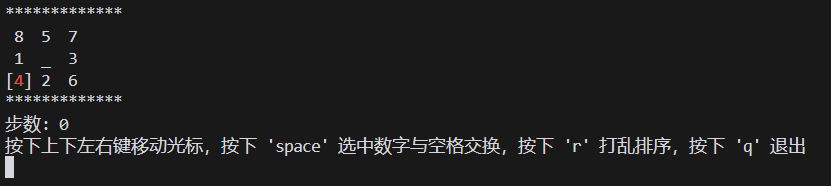
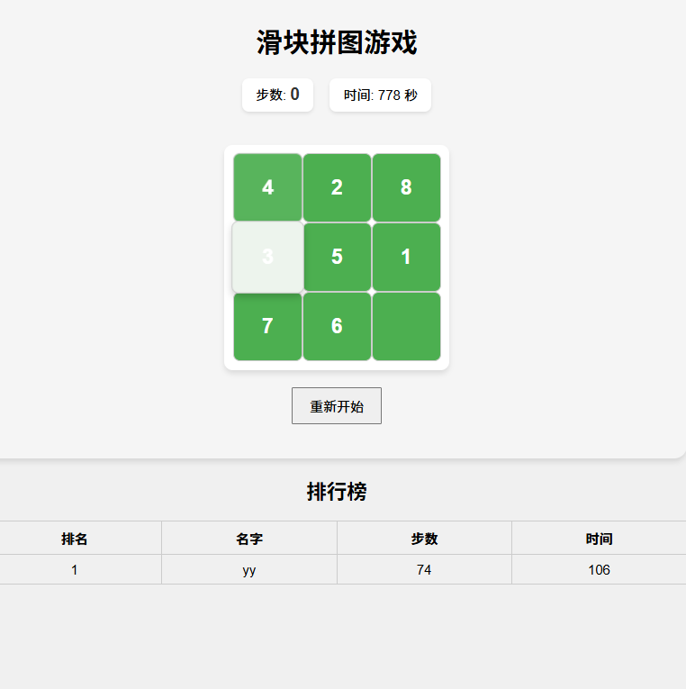

puzzle_game dev by ai

## 项目结构

- puzzle_cli: 命令行版本
- puzzle_web: web版本
- main.py 单文件


## 项目功能
- 滑动拼图
- 命令行版本
- web版本


## 项目运行
- 安装依赖
``` pip install -r requirements.txt ```
- 命令行版本
``` python ./puzzle_cli/main_loop.py ```
- web版本
``` python ./puzzle_web/main.py ```




